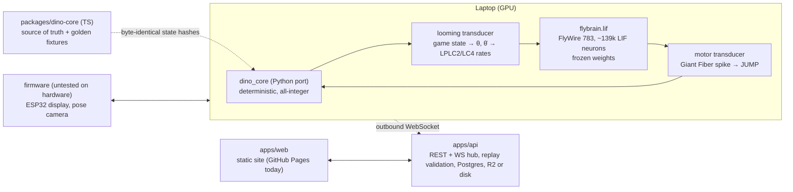

# Architecture

This document describes what exists today (Phases 0–6 as code; see docs/PROGRESS.md for what is measured, deployed or still untested). Not-yet-built
components are marked *(planned)* and are not in the repository yet.

## Components

## The closed loop (Phase 1)

Per 60 Hz game frame (`BIO_MS_PER_FRAME` of biological time, 0.1 ms LIF steps):

1. **Game → senses** (`flybrain/transducer/looming.py`): for the nearest obstacle ahead, the angle θ it subtends at
   the dino's eye and its analytic expansion rate θ̇ (2-D geometry, no free scale). Fixed rate functions map
   (θ, θ̇) to Poisson rates of the LPLC2 and LC4 populations — the same parameterised looming stimulus that is
   shown to real flies.
2. **Brain** (`flybrain/lif.py`): the whole connectome advances; weights are frozen as reconstructed.
3. **Brain → action** (`flybrain/transducer/motor.py`): a Giant Fiber (DNp01) spike in frame *f* presses JUMP at
   frame *f+1*. Nothing is decoded or learned.
4. **Game step** (`flybrain/dino_core.py`, a port of `packages/dino-core`).

Many independent (brain, game) pairs run as columns of one batched simulation.

## LIF engine

Brian2-faithful semantics of the published model (see the module docstring of `flybrain/lif.py`): exact
propagator, integrate → threshold → deliver/kick → reset, 18-step delay, 22-step refractory period during which
input is dropped, refractory-free Poisson targets.

Event-driven: because the synaptic delay is 18 steps, up to 18 steps run as pure elementwise updates; then one
`nonzero` collects the chunk's spikes, which are expanded through a presynaptic-sorted adjacency and scattered as
**signed integer synapse counts** into a ring buffer at `step + 18` (order-independent ⇒ deterministic).
Poisson drive uses counter-based random numbers keyed by (trial seed, neuron, step), so results do not depend on
batch size, chunk size, column recycling or device. All per-step ops are device-side, so a chunk can be replayed
as a CUDA graph.

## Determinism contract for the game engine

`packages/dino-core` (TypeScript) is the source of truth: pure `step(state, input)`, all-integer fixed-point
state (1 px = 1000), mulberry32 state inside the game state, constants in one `constants.json` shared with the
Python port. Golden fixtures store recorded actions and a per-frame hash of the canonical state; the Python port
must match every hash. The API replays submitted human runs — and the fly's runs reported by the worker — with the same engine and stores
only the replayed score.

## Learning (Phase 4)

Only the 62,261 KC→MBON connections are plastic. In the engine they travel through a small float ring buffer that
covers just the MBONs (weight = frozen synapse count × gain; identical to the frozen network at gain 1). Once per game
frame `flybrain/plasticity.py` updates per-synapse eligibility traces from Kenyon-cell and MBON spike counts and, when
dopaminergic neurons fire, depresses eligible synapses in proportion to the dopamine each MBON receives
(DAN→MBON synapse counts as compartment proxy). Reward (obstacle cleared) drives the PAM cluster, punishment (crash)
the PPL1 cluster; a coarse visual context reaches the Kenyon cells through the 265 visual projection neurons that
synapse onto them. A generation is a gain vector; evaluation always uses the same 100 held-out seeds with plasticity off.

## Data

Nothing large is committed. `flybrain download-data` fetches pinned URLs and enforces SHA-256
(`brain/flybrain/data_manifest.json`). FlyWire root IDs are int64 (> 2^53) and never pass through floats or JSON numbers.
