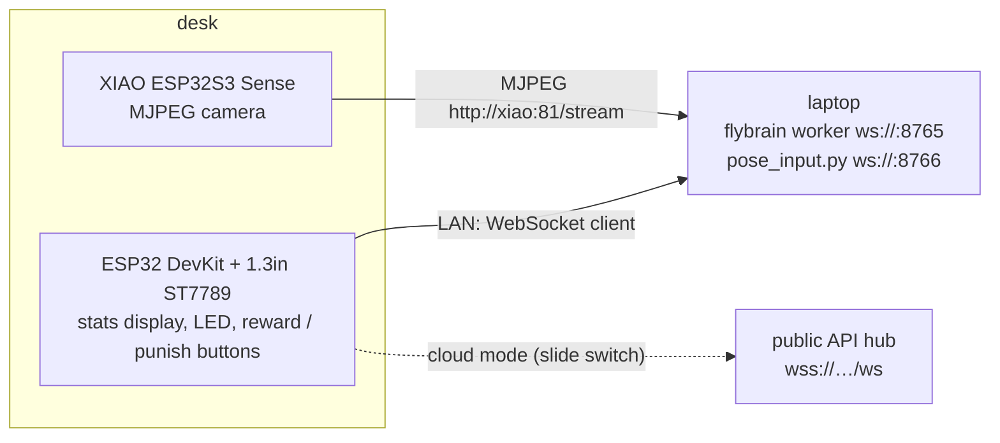

# Hardware

> **Status: firmware written, not yet flashed or tested on hardware.** No board was attached when this code was
> written. The pose detector logic is unit-tested (`brain/tests/test_pose.py`); everything that touches pins is not.
> Treat the first flash as a bring-up session and fix pins here if your board differs.

Two small nodes sit on the desk next to the laptop that runs the brain.



## 1. Stats display — `firmware/stats-display`

ESP32 DevKit (30-pin) + GMT130 1.3" IPS 240×240 **ST7789 without CS pin** (pins GND, VCC, SCK, SDA, RES, DC, BLK).
Library: LovyanGFX, SPI mode 3 (required by CS-less ST7789 modules), `pin_cs = -1`.

| Part | Part pin | ESP32 GPIO | Note |
|---|---|---|---|
| Display | GND | GND | |
| Display | VCC | 3V3 | 3.3 V only |
| Display | SCK | GPIO 18 | VSPI clock |
| Display | SDA | GPIO 23 | VSPI MOSI |
| Display | RES | GPIO 4 | reset |
| Display | DC | GPIO 2 | data/command |
| Display | BLK | GPIO 15 | backlight (PWM) |
| LED (+ 330 Ω in series) | anode | GPIO 25 | flashes on every Giant Fiber spike; cathode → GND |
| Button "reward" | one leg | GPIO 32 | other leg → GND (internal pull-up) |
| Button "punish" | one leg | GPIO 33 | other leg → GND; **hold > 0.7 s = next screen** |
| Slide switch LAN/cloud | common | GPIO 27 | other contact → GND; closed = LAN, open = cloud |

Pins live in `include/pins.h`. Screens: (0) generation / best / current score, (1) session counters and brain speed,
(2) learning-curve sparkline, (3) live mini game drawn from the canonical game state in `fly.frame`.
Buttons send `dopamine.event` with `source: "hardware"` (see `docs/PROTOCOL.md`).

```bash
cd firmware/stats-display
cp include/secrets.example.h include/secrets.h     # Wi-Fi + laptop IP; git-ignored
pio run -t upload && pio device monitor
# on the laptop, let the LAN reach the feed:
cd brain && uv run --no-sync flybrain worker --host 0.0.0.0
```

## 2. Pose camera — `firmware/pose-cam`

Seeed XIAO ESP32S3 Sense (OV2640, PSRAM). Streams QVGA MJPEG at `http://<ip>:81/stream`; the laptop does the vision:

```bash
cd firmware/pose-cam && cp include/secrets.example.h include/secrets.h && pio run -t upload
uv run --no-sync --with mediapipe --with opencv-python python brain/pose/pose_input.py --source http://<xiao-ip>:81/stream
```

`pose_input.py` calibrates for 2 s while you stand still, then emits `human.input` messages (`jump` when the hips
rise > 12 % of your nose-to-hip length, `duck` when the nose drops > 30 %) on `ws://localhost:8766`.
A laptop webcam works the same way (`--source 0`).

Not built yet: wiring the pose events into the Play page (the page listens to keyboard and touch today), the
calibration UI on `/lab`, on-device TFLite pose, and the INMP441 clap-to-startle easter egg.
