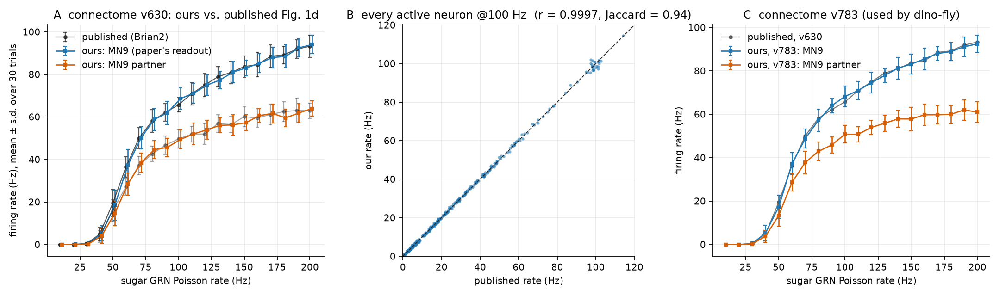
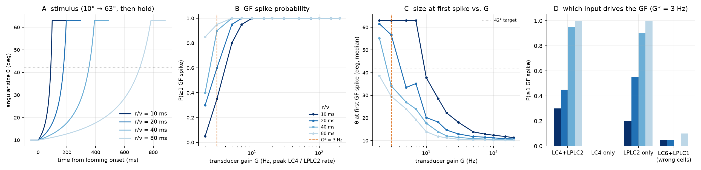
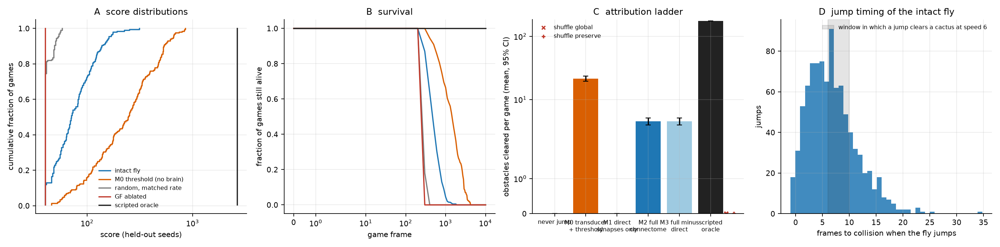
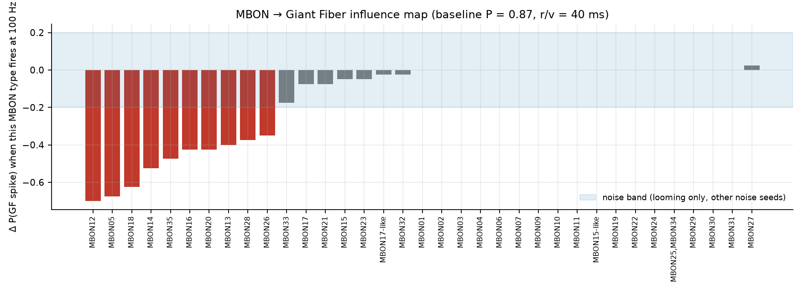
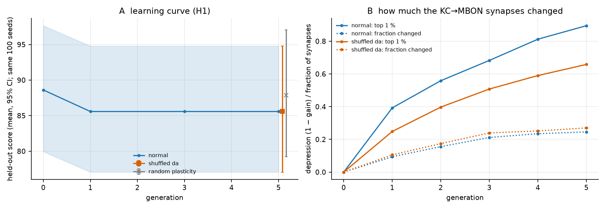

# Research log: can a fruit-fly brain play Chrome Dino?

Every number in this document is rendered from a JSON file written by a script in `brain/experiments/`
(`python -m experiments.report` fills the blocks between `BEGIN/END` markers; CI fails if they are stale).
Anything without a number is **not yet measured**.

## Rules of the game

1. Connectome weights are frozen as reconstructed (FlyWire 783); 2. the only learning mechanism (Phase 4+) is
dopamine-gated plasticity at KC→MBON synapses; 3. input only via identified sensory pathways, output only via
identified descending neurons, through fixed hand-written transducers; 4. failures are results.

## Phase 0 — Is our engine the published model?

**Question.** Does our PyTorch LIF engine reproduce the published whole-brain model (Shiu et al. 2024)?

**Method.** (i) Semantic exactness: spike-for-spike agreement with real Brian2 on a synthetic network with
deterministic input (covers the off-by-one cases a firing-rate comparison cannot see). (ii) The paper's own
experiment: 21 labellar sugar GRNs driven with Poisson input at 10–200 Hz, 30 trials × 1 s, read out at the MN9
proboscis motor neuron, on the connectome version the paper used (v630), compared with the paper's Fig. 1d source
data; plus per-neuron firing rates across the whole network against the published example spike files.
(iii) The same protocol on v783, the connectome everything else in this project uses (no published reference exists).

<!-- BEGIN:sugar_mn9 -->
**Result 1 — spike-exact equivalence with Brian2.**
On the real v630 connectome (127,400 neurons, 14.7 M connections), real Brian2 and our engine were fed the same kick schedule (100 Hz on the 21 sugar GRNs, 10,000 steps, float64): **identical spike trains, 0 mismatches** in 2 trials (10,269, 9,317 spikes). Brian2 (numpy target) needed 17.8 s per trial, our engine 3.4 s. The same check on a synthetic 1k-neuron network with autapses, duplicate edges and strong inhibition is a unit test in CI (`tests/test_lif_brian2_golden.py`). Source: `results/brian2_crosscheck_flywire630.json`.

**Result 2 — the published sugar → MN9 curve (connectome v630, 30 trials × 1 s).**

| GRN rate (Hz) | MN9 published | MN9 ours | diff | MN9 partner published | MN9 partner ours |
|---:|---:|---:|---:|---:|---:|
| 20 | 0.0 | 0.0 | +0.0 | 0.0 | 0.0 |
| 40 | 4.8 | 5.2 | +0.3 | 3.7 | 4.0 |
| 50 | 19.4 | 18.4 | -1.0 | 16.0 | 14.6 |
| 60 | 36.4 | 37.3 | +0.9 | 27.1 | 28.4 |
| 80 | 58.1 | 58.8 | +0.6 | 42.6 | 44.6 |
| 100 | 65.7 | 68.6 | +2.9 | 49.7 | 49.4 |
| 120 | 75.0 | 74.9 | -0.1 | 52.0 | 53.9 |
| 140 | 80.9 | 81.1 | +0.2 | 56.4 | 56.2 |
| 150 | 83.7 | 83.1 | -0.6 | 60.1 | 57.3 |
| 160 | 84.6 | 85.2 | +0.6 | 59.5 | 60.6 |
| 180 | 89.2 | 88.5 | -0.7 | 62.5 | 59.5 |
| 200 | 93.2 | 94.0 | +0.8 | 62.9 | 63.9 |

RMSE over the 20-point curve: 0.89 Hz (MN9), 1.31 Hz (partner); largest deviation 2.93 Hz; 20/20 points within the pre-registered band.
Pre-registered criterion at 100 Hz (|ours − 65.7| ≤ 3 Hz): ours 68.63 Hz, diff +2.93 Hz → **PASS**.
Context for that number: the paper's Fig. 1d run gives 65.7 Hz and the authors' own second published 100 Hz run (`results/example/sugarR_100Hz.parquet`) gives 67.03 Hz; re-running the published stochastic protocol in real Brian2 on this machine (30 trials) gives 67.73 ± 0.68 Hz (mean ± SE); our engine with 300 trials gives 67.20 ± 0.28 Hz. Given Result 1, remaining differences are sampling noise of 30-trial estimates, not model differences.

**Result 3 — every neuron, not just MN9 (v630 vs. the published example spike files).**

| GRN rate | active neurons (published / ours) | Jaccard | Pearson r of rates | spikes per trial (published / ours) |
|---:|---:|---:|---:|---:|
| 100 Hz | 404 / 409 | 0.936 | 0.9997 | 9,636 / 9,681 |
| 200 Hz | 448 / 454 | 0.961 | 0.9998 | 17,052 / 17,016 |

**Result 4 — connectome v783, the one dino-fly uses (no published reference exists).**
MN9 at 100 Hz sugar drive: **68.2 Hz** (partner 50.8 Hz); at 200 Hz: 92.4 Hz. Network-wide 16,848 spikes per simulated second at 200 Hz across 448 active neurons of 138,639 (a third-party Brian2-CPU benchmark of the same condition reports ≈ 17,050). 

Sources: `results/sugar_mn9.json`, `flybrain/reference/shiu2024_fig1d.json` (script-extracted from doi:10.17617/3.CZODIW).
<!-- END:sugar_mn9 -->

## Phase 0 — How fast is it?

<!-- BEGIN:benchmark -->
GPU: NVIDIA GeForce RTX 5060 Laptop GPU; torch 2.14.0+cu130; connectome flywire783 (138,639 neurons, 15,091,983 connections); dt = 0.1 ms; float32.

| engine path | brains (B) | drive | ms / step | biological s per wall s (per brain) | … (all brains) | peak VRAM (GB) |
|---|---:|---|---:|---:|---:|---:|
| eager | 1 | rest | 0.332 | 0.301 | 0.30 | 0.21 |
| eager | 1 | sugar GRNs 100 Hz | 0.373 | 0.268 | 0.27 | 0.21 |
| eager | 8 | rest | 0.355 | 0.281 | 2.25 | 0.40 |
| eager | 8 | sugar GRNs 100 Hz | 0.410 | 0.244 | 1.95 | 0.40 |
| eager | 32 | rest | 1.503 | 0.067 | 2.13 | 1.04 |
| eager | 32 | sugar GRNs 100 Hz | 1.630 | 0.061 | 1.96 | 1.04 |
| eager | 64 | rest | 3.573 | 0.028 | 1.79 | 1.88 |
| eager | 64 | sugar GRNs 100 Hz | 3.847 | 0.026 | 1.66 | 1.90 |
| cuda-graph | 1 | rest | 0.167 | 0.599 | 0.60 | 0.24 |
| cuda-graph | 1 | sugar GRNs 100 Hz | 0.262 | 0.382 | 0.38 | 0.24 |
| cuda-graph | 8 | rest | 0.343 | 0.292 | 2.34 | 0.59 |
| cuda-graph | 8 | sugar GRNs 100 Hz | 0.452 | 0.221 | 1.77 | 0.59 |
| cuda-graph | 32 | rest | 1.468 | 0.068 | 2.18 | 1.81 |
| cuda-graph | 32 | sugar GRNs 100 Hz | 1.727 | 0.058 | 1.85 | 1.81 |
| cuda-graph | 64 | rest | 3.569 | 0.028 | 1.79 | 3.43 |
| cuda-graph | 64 | sugar GRNs 100 Hz | 3.631 | 0.028 | 1.76 | 3.43 |
| eager | 32 | sugar GRNs 100 Hz | 2.788 | 0.036 | 1.15 | 0.66 |
| eager | 32 | sugar GRNs 100 Hz | 1.728 | 0.058 | 1.85 | 0.86 |

Source: `results/benchmark.json`.
<!-- END:benchmark -->

## Phase 1 — Does looming reach the Giant Fiber?

<!-- BEGIN:looming_gf -->
Protocol: r/v ∈ {10, 20, 40, 80} ms, 10° → 63°, 20 trials each, all 104 LC4 and 210 LPLC2 neurons driven (both sides), connectome flywire783, dt 0.1 ms.

| G (Hz) | P(GF spike) overall | median θ at first spike (deg) | P(spike) per r/v = 10 / 20 / 40 / 80 ms |
|---:|---:|---:|---|
| 2 | 0.40 | 49.4 | 0.05 / 0.30 / 0.40 / 0.85 |
| 3 | 0.70 | 40.3 | 0.35 / 0.60 / 0.90 / 0.95 |
| 5 | 0.94 | 29.3 | 0.80 / 0.95 / 1.00 / 1.00 |
| 7 | 0.99 | 26.3 | 0.95 / 1.00 / 1.00 / 1.00 |
| 10 | 1.00 | 18.7 | 1.00 / 1.00 / 1.00 / 1.00 |
| 15 | 1.00 | 15.6 | 1.00 / 1.00 / 1.00 / 1.00 |
| 20 | 1.00 | 12.9 | 1.00 / 1.00 / 1.00 / 1.00 |
| 30 | 1.00 | 11.9 | 1.00 / 1.00 / 1.00 / 1.00 |
| 50 | 1.00 | 11.4 | 1.00 / 1.00 / 1.00 / 1.00 |
| 75 | 1.00 | 11.1 | 1.00 / 1.00 / 1.00 / 1.00 |
| 100 | 1.00 | 10.8 | 1.00 / 1.00 / 1.00 / 1.00 |
| 150 | 1.00 | 10.6 | 1.00 / 1.00 / 1.00 / 1.00 |
| 200 | 1.00 | 10.6 | 1.00 / 1.00 / 1.00 / 1.00 |

**Calibration (calibrated): G\* = 3 Hz** — median angular size at the first GF spike 40.3° (target 42°), P(spike) = 0.70. This value is frozen as `TRANSDUCER_VERSION = 1` before any game is played.

At G\*:

| r/v (ms) | P(spike) | GF spikes / trial | first spike: ms after onset | ms before collision | θ at first spike, median [IQR] |
|---:|---:|---:|---:|---:|---|
| 10 | 0.30 | 0.3 | 117 | -2 | 63.0° [63.0, 63.0] |
| 20 | 0.45 | 0.5 | 202 | 27 | 63.0° [58.7, 63.0] |
| 40 | 0.95 | 1.1 | 348 | 109 | 40.2° [35.7, 55.4] |
| 80 | 1.00 | 2.2 | 646 | 269 | 33.1° [28.4, 35.0] |

- **Which input matters:** LC4 only → P(spike) 0.00; LPLC2 only → 0.66; both → 0.68.
- **Wrong cell types (same drive into LC6 + LPLC1):** P(GF spike) = 0.05.
- **Specificity of the readout:** of 1,299 descending neurons, 18 fire at all under this drive; the two GFs rank 6 and 1 by spike probability (P = 0.17, 0.68).
- **Size-threshold behaviour (GF spiking disabled):** angular size at the peak of the GF membrane potential: 63° (r/v 10 ms), 63° (r/v 20 ms), 47° (r/v 40 ms), 44° (r/v 80 ms). In real flies the GF response peaks at a roughly constant angular size across r/v (Ache et al. 2019).
- **Sensitivity to our choice σ = 15°:** median size at first spike 45.6° (σ = 10°) and 19.3° (σ = 25°).

Source: `results/looming_gf.json`.
<!-- END:looming_gf -->

## Phase 1 — How does the naive fly play?

<!-- BEGIN:naive_play -->
Protocol: 200 held-out seeds (HELDOUT_200), engine v1, transducer v1 (G = 3 Hz), 10 ms biological time per frame, dt 0.1 ms, games capped at 10,000 frames, pre-registration tag `prereg-phase1`. All comparisons are paired by seed.

| condition | score mean [95% CI] | score median | max | obstacles cleared (mean) | jumps / game | capped |
|---|---:|---:|---:|---:|---:|---:|
| `intact` | 83.3 [77.6, 89.3] | 71 | 312 | 4.51 | 4.6 | 0 |
| `gf_ablated` | 40.0 [40.0, 40.0] | 40 | 40 | 0.00 | 0.0 | 0 |
| `gf_output_zeroed` | 83.3 [77.6, 89.3] | 71 | 312 | 4.51 | 4.6 | 0 |
| `random_matched` | 42.0 [41.4, 42.6] | 40 | 58 | 0.21 | 2.5 | 0 |
| `yoked` | 52.6 [51.3, 54.0] | 50 | 110 | 1.35 | 1.6 | 0 |
| `never_jump` | 40.0 [40.0, 40.0] | 40 | 40 | 0.00 | 0.0 | 0 |
| `m0_threshold` | 281.5 [255.9, 307.8] | 245 | 849 | 21.52 | 21.7 | 0 |
| `m1_monosynaptic` | 40.0 [40.0, 40.0] | 40 | 40 | 0.00 | 0.0 | 0 |
| `m3_no_direct` | 83.2 [77.5, 89.2] | 70 | 312 | 4.50 | 4.6 | 0 |
| `intact_noise1` | 83.7 [78.3, 89.2] | 72 | 220 | 4.64 | 4.7 | 0 |
| `intact_noise2` | 84.2 [77.8, 91.1] | 69 | 270 | 4.63 | 4.7 | 0 |
| `intact_bio16.7` | 153.4 [139.7, 167.8] | 120 | 549 | 11.14 | 11.3 | 0 |
| `oracle` | 2637.0 [2637.0, 2637.0] | 2637 | 2637 | 175.09 | 144.9 | 200 |
| `shuffle_global` × 20 (degree-preserving shuffle of the whole connectome) | score mean per realisation 40.0 (range 40.0–40.0) | | | 0.00 (range 0.00–0.00) | 0.0 | |
| `shuffle_preserve` × 5 (shuffle preserving LC4/LPLC2-out and GF-in edges) | score mean per realisation 40.0 (range 40.0–40.0) | | | 0.00 (range 0.00–0.00) | 0.0 | |

**The intact fly in numbers:** GF fires 1.0 spikes per biological second (0.9 per obstacle approach; P(≥1 GF spike per approach) = 0.83); P(jump per approach) = 0.82; P(cleared | jumped) = 0.99; median reaction latency 510 ms (biological) from obstacle entering view to first GF spike, at θ = 42.0° / 47 px; median jump 6.3 frames before collision; jumps with nothing in view: 0.0%. Deaths by obstacle: CACTUS_SMALL 114, CACTUS_LARGE 86, PTERODACTYL 0.

**Paired comparisons against the intact fly (obstacles cleared; Wilcoxon signed-rank, Holm-corrected):**

| condition | mean difference intact − condition [95% CI] | p (Holm) | rank-biserial r |
|---|---:|---:|---:|
| `gf_ablated` | +4.51 [+3.94, +5.09] | 2.1e-29 | +1.00 |
| `m1_monosynaptic` | +4.51 [+3.94, +5.09] | 2.1e-29 | +1.00 |
| `m3_no_direct` | +0.01 [-0.06, +0.10] | 1 | +0.00 |
| `gf_output_zeroed` | +0.00 [+0.00, +0.00] | 1 | +0.00 |
| `intact_noise1` | -0.13 [-0.93, +0.69] | 1 | -0.02 |
| `intact_noise2` | -0.12 [-0.98, +0.74] | 1 | -0.02 |
| `intact_bio16.7` | -6.63 [-8.08, -5.25] | 3.5e-14 | -0.66 |
| `never_jump` | +4.51 [+3.94, +5.09] | 2.1e-29 | +1.00 |
| `oracle` | -170.57 [-171.25, -169.88] | 1.6e-33 | -1.00 |
| `m0_threshold` | -17.00 [-19.02, -15.05] | 1.9e-29 | -0.97 |
| `random_matched` | +4.30 [+3.73, +4.88] | 2.3e-28 | +0.99 |
| `yoked` | +3.16 [+2.58, +3.75] | 1.8e-19 | +0.83 |

Source: `results/naive_play.json` (per-game records incl. action logs are cached locally, not committed).
<!-- END:naive_play -->

## Phase 4 — Can the mushroom body reach the escape circuit?

**Question.** KC→MBON plasticity can only matter for the game if MBON activity influences the Giant Fiber through
the real wiring. Does it, in this model?

<!-- BEGIN:mbon_influence -->
There are **0 direct MBON → GF synapses** in the connectome, so any influence is polysynaptic. Protocol: looming r/v = 40 ms through the frozen transducer (G = 3 Hz), 40 trials; each MBON type driven at 100 Hz. Baseline P(GF spike) = 0.87; a change is called real only outside ±0.20 (spread across noise seeds + 2 s.e.).

**10 of 35 MBON types** move the GF response outside the noise band; 0 can make the GF fire on their own.

| MBON type | neurons | predicted transmitter | ΔP(GF spike) with looming | P(GF spike) alone |
|---|---:|---|---:|---:|
| MBON12 | 4 | acetylcholine | -0.70 | 0.00 |
| MBON05 | 2 | acetylcholine | -0.68 | 0.00 |
| MBON18 | 2 | acetylcholine | -0.62 | 0.00 |
| MBON14 | 4 | acetylcholine | -0.53 | 0.00 |
| MBON35 | 2 | acetylcholine | -0.48 | 0.00 |
| MBON16 | 2 | acetylcholine | -0.43 | 0.00 |
| MBON20 | 2 | gaba | -0.43 | 0.00 |
| MBON13 | 2 | acetylcholine | -0.40 | 0.00 |
| MBON28 | 2 | acetylcholine | -0.38 | 0.00 |
| MBON26 | 2 | acetylcholine | -0.35 | 0.00 |

(ten largest effects shown; all 35 types are in the JSON)

Source: `results/mbon_influence.json`.
<!-- END:mbon_influence -->

## Phase 4 — Can visual context reach the mushroom body without disturbing the reflex?

**Question.** The mushroom body can only associate outcomes with situations it is told about. The brief's design is
to encode a coarse visual context (obstacle class × proximity) in the visual projection neurons that synapse onto
Kenyon cells. Two things must hold for a learning experiment to mean anything: the context must make MBONs fire
(the published model has no spontaneous activity, so a silent MBON stays silent however its synapses change), and
it must leave the innate reflex alone — those visual neurons are real neurons with many other targets.
The selection rule was written into `experiments/mb_drive.py` before its results existed; no game score is involved.

<!-- BEGIN:mb_drive -->
9 never-jumping dinos run into their first obstacle; the views are replayed into a naive brain. 265 visual projection neurons synapse directly onto 427 Kenyon cells, which reach 85 of the 96 MBONs. Reference (looming only): P(GF spike) = 0.89, first spike 8 frames before the crash, 0.0 dopaminergic spikes per approach.

| context neurons | code | ramp | peak rate (Hz) | context alone: GF spikes | dopaminergic spikes / approach | KCs active | visually reachable MBONs, last 300 ms (Hz) | with looming: P(GF spike) | spike-time shift (frames) | reflex preserved |
|---:|---|---:|---:|---:|---:|---:|---:|---:|---:|---|
| 47 | class_only | — | 100 | 0 | 0 | 106 | 0.19 | 0.00 | — | no |
| 47 | class_only | — | 200 | 0 | 108 | 194 | 5.77 | 0.00 | — | no |
| 47 | class_only | — | 300 | 1 | 97 | 220 | 6.54 | 0.11 | +59 | no |
| 47 | class_only | 30° | 100 | 0 | 0 | 69 | 0.20 | 0.00 | — | no |
| 47 | class_only | 30° | 200 | 0 | 11 | 150 | 1.94 | 0.00 | — | no |
| 47 | class_only | 30° | 300 | 0 | 26 | 197 | 4.09 | 0.11 | +6 | no |
| 30 | class_only | — | 100 | 0 | 0 | 79 | 0.09 | 0.00 | — | no |
| 30 | class_only | — | 200 | 0 | 0 | 130 | 1.47 | 0.00 | — | no |
| 30 | class_only | — | 300 | 0 | 46 | 171 | 4.41 | 0.22 | +0 | no |
| 30 | class_only | 30° | 100 | 0 | 0 | 50 | 0.08 | 0.00 | — | no |
| 30 | class_only | 30° | 200 | 0 | 0 | 109 | 0.84 | 0.00 | — | no |
| 30 | class_only | 30° | 300 | 0 | 2 | 143 | 2.10 | 0.11 | +1 | no |
| 265 | one_of_9 | — | 100 | 6 | 0 | 23 | 0.00 | 0.78 | +6 | no |
| 265 | one_of_9 | — | 200 | 10 | 0 | 57 | 0.07 | 0.67 | +8 | no |
| 265 | one_of_9 | 30° | 100 | 6 | 0 | 4 | 0.00 | 0.78 | +2 | no |
| 265 | one_of_9 | 30° | 200 | 8 | 0 | 21 | 0.00 | 0.67 | +2 | no |
| 265 | random_half | — | 100 | 15 | 0 | 126 | 0.17 | 0.67 | +70 | no |
| 265 | random_half | — | 200 | 20 | 576 | 586 | 12.16 | 0.56 | +69 | no |
| 265 | random_half | 30° | 100 | 17 | 0 | 72 | 0.17 | 0.56 | +63 | no |
| 265 | random_half | 30° | 200 | 16 | 0 | 168 | 1.10 | 1.00 | +66 | no |
| 265 | class_only | — | 100 | 17 | 1 | 79 | 0.12 | 0.89 | +68 | no |
| 265 | class_only | — | 200 | 21 | 577 | 519 | 11.98 | 0.56 | +69 | no |
| 265 | class_only | 30° | 100 | 24 | 0 | 48 | 0.15 | 0.78 | +51 | no |
| 265 | class_only | 30° | 200 | 20 | 10 | 119 | 1.33 | 1.00 | +66 | no |

**No configuration preserves the reflex.**

Source: `results/mb_drive.json`.
<!-- END:mb_drive -->

**Reading.** Driving all 265 KC-projecting visual neurons fires the Giant Fiber by itself — the dino would jump at
the mere sight of an obstacle, up to ~70 frames too early. Restricting the drive to the 47 (or 30) neurons that are dedicated
mushroom-body inputs avoids that but *abolishes* the looming-evoked GF spike, at rates where MBONs are still nearly
silent — so the suppression does not run through the mushroom body and learning could not undo it. In this model the
escape reflex sits at threshold (the frozen transducer gain is only 3 Hz), and no visual-projection-level context
drive that we tried leaves it intact. Strong drives also make dopaminergic neurons fire from network activity alone
(table: up to several hundred spikes per approach; a full punishment burst of the transducer is 16 PPL1 neurons ×
100 Hz × 100 ms ≈ 160 spikes), which would gate plasticity regardless of what happens in the game.

**Deviation (DECISIONS.md D13), flagged for review.** To test the learning hypotheses at all, the context is delivered
one synapse further in: directly to the 388 Kenyon cells that receive input from the dedicated visual neurons. This
bends the project's rule 3 (sensory input only through identified sensory pathways); it adds no learned component.
The same diagnostic and the same rule:

<!-- BEGIN:mb_drive_kc -->
Same protocol, but the context drives the visual Kenyon cells themselves (rates are Kenyon-cell firing rates). Reference (looming only): P(GF spike) = 0.89, first spike 8 frames before the crash, 0.0 dopaminergic spikes per approach.

| context neurons | code | ramp | peak rate (Hz) | context alone: GF spikes | dopaminergic spikes / approach | KCs active | visually reachable MBONs, last 300 ms (Hz) | with looming: P(GF spike) | spike-time shift (frames) | reflex preserved |
|---:|---|---:|---:|---:|---:|---:|---:|---:|---:|---|
| 388 | class_only | — | 5 | 0 | 0 | 191 | 0.00 | 0.89 | +0 | yes |
| 388 | class_only | — | 10 | 0 | 0 | 195 | 0.11 | 0.89 | +0 | yes |
| 388 | class_only | — | 20 | 0 | 6 | 195 | 1.25 | 0.89 | +0 | yes |
| 388 | class_only | — | 40 | 0 | 86 | 195 | 3.12 | 0.89 | +0 | yes |
| 388 | class_only | 30° | 5 | 0 | 0 | 161 | 0.00 | 0.89 | +0 | yes |
| 388 | class_only | 30° | 10 | 0 | 0 | 188 | 0.05 | 0.89 | +0 | yes |
| 388 | class_only | 30° | 20 | 0 | 1 | 194 | 0.75 | 0.89 | +0 | yes |
| 388 | class_only | 30° | 40 | 0 | 19 | 195 | 2.28 | 0.89 | +0 | yes |

**Chosen by the pre-written rule: 388 neurons, `class_only`, ramp 0°, 40 Hz** — visually reachable MBONs fire 3.12 Hz before the collision, above the 1 Hz criterion.

Source: `results/mb_drive_kc.json`.
<!-- END:mb_drive_kc -->

**Reading.** A Kenyon-cell-level context leaves the reflex untouched and makes MBONs fire — mostly MBON27, MBON09 and
MBON32, which the influence map above found to have *no* effect on the Giant Fiber. What the wiring allows in
principle (connectome only):

<!-- BEGIN:mb_wiring -->
The 388 visual Kenyon cells make 14,544 synapses onto MBONs. The twelve MBON types that receive most of them:

| MBON type | neurons | predicted transmitter → H2 class | synapses from visual KCs | share | from all KCs | from PAM | from PPL1 | ΔP(GF spike) when driven |
|---|---:|---|---:|---:|---:|---:|---:|---:|
| MBON09 | 4 | gaba → approach | 2,249 | 15% | 32,119 | 889 | 4 | +0.00 |
| MBON05 | 2 | acetylcholine/glutamate → approach/avoidance | 2,155 | 15% | 20,400 | 1,470 | 15 | -0.68 **(outside noise band)** |
| MBON27 | 2 | acetylcholine → approach | 1,733 | 12% | 2,633 | 231 | 3 | +0.02 |
| MBON11 | 2 | gaba → approach | 1,208 | 8% | 18,360 | 61 | 954 | +0.00 |
| MBON07 | 4 | glutamate → avoidance | 1,182 | 8% | 22,762 | 1,556 | 5 | +0.00 |
| MBON06 | 2 | glutamate → avoidance | 1,094 | 8% | 12,216 | 1,329 | 19 | +0.00 |
| MBON32 | 2 | gaba → approach | 843 | 6% | 4,738 | 10 | 280 | -0.03 |
| MBON01 | 2 | glutamate → avoidance | 690 | 5% | 9,022 | 397 | 0 | +0.00 |
| MBON35 | 2 | acetylcholine → approach | 508 | 3% | 1,875 | 13 | 294 | -0.48 **(outside noise band)** |
| MBON20 | 2 | gaba → approach | 340 | 2% | 1,869 | 6 | 25 | -0.43 **(outside noise band)** |
| MBON02 | 2 | gaba/glutamate → approach/avoidance | 311 | 2% | 9,931 | 431 | 0 | +0.00 |
| MBON19 | 4 | acetylcholine → approach | 310 | 2% | 859 | 0 | 27 | +0.00 |

MBON types that move the Giant Fiber outside the noise band of the influence map receive **24%** of the visual-KC → MBON synapses (MBON05 2,155, MBON35 508, MBON20 340, MBON14 305, MBON12 153, …).

Source: `results/mb_wiring.json` (connectome only; ΔP from `results/mbon_influence.json`).
<!-- END:mb_wiring -->

So a route exists on paper — visual Kenyon cells → MBON05 / MBON35 / MBON20 → … → Giant Fiber, with PAM dopamine on
MBON05 — but with the context on, the looming response of the naive fly is unchanged (table above: P(GF spike) 0.89
with and without context), i.e. those MBONs are not driven hard enough to suppress anything that learning could then
release. The prediction for H1, stated before the learning experiment ran: changing the visually driven KC→MBON
synapses should change nothing the Giant Fiber can feel.

## Phase 4 — Can the model take a dopamine burst?

Early pilots of the learning experiment (DEV seeds) showed implausibly fast, non-specific depression of most
KC→MBON synapses, whatever the learning rate. The cause was not the rule but the network: a few frames after some
crashes a large fraction of all Kenyon cells start firing together although nothing drives them, and the state sustains
itself (the published model treats dopamine like a fast excitatory transmitter and has no adaptation, and PAM / PPL1
neurons are wired recurrently with Kenyon cells and MBONs). Measured:

<!-- BEGIN:kc_volley -->
16 games (13 crashes) with looming, visual context and dopamine bursts, plasticity off. A volley frame has more than 300 Kenyon-cell spikes; with the context alone the median is 76.

- **2 volley onsets in 13 crashes**; 9 volley frames of 8,199 column-frames, 9 of them inside the punishment tail after a crash (onset 9–12 frames after the crash).
- In a volley frame a median of **1632 of 5,177 Kenyon cells** fire and dopaminergic neurons fire 102 spikes per frame (the punishment burst itself, 16 PPL1 neurons at 100 Hz, accounts for ≈ 16 per frame at most; the rest is driven by the network).
- Replaying the first 8 seeds in reversed column order: onsets **reappear at the same frame of the same game** — a property of the game state, not of the batched engine.

Source: `results/kc_volley.json`.
<!-- END:kc_volley -->

Our play loop used to leave a finished game's brain column running until the whole batch was done — with a volley
going and endogenous dopamine gating plasticity on everything. Two consequences: (1) the loop now silences a column
as soon as its game is over and idle columns never reach the learning rule (regression test
`test_columns_without_a_game_are_silent_and_never_teach`); what remains is confined to the ≤ 15-frame punishment tail
after a crash and is counted in every learning result (`kc_volley_column_frames`). (2) We checked whether the
reward / punishment bursts themselves ignite the mushroom body:

<!-- BEGIN:da_burst -->
One brain column per configuration; 307 PAM or 16 PPL1 neurons driven; 200 ms baseline, burst, 600 ms after; the last 200 ms are undriven. *Ignites* = more than 10 Kenyon-cell spikes per 10-ms frame in those last 200 ms.

| cluster | rate (Hz) | duration (ms) | context | KC spikes / frame: before | during burst | last 200 ms | DAN spikes / frame, last 200 ms | ignites |
|---|---:|---:|---|---:|---:|---:|---:|---|
| PAM | 10 | 50 | off | 0.0 | 0.0 | 0.0 | 0.0 | no |
| PAM | 10 | 50 | on | 81.1 | 81.2 | 0.0 | 0.1 | no |
| PAM | 10 | 100 | off | 0.0 | 0.0 | 0.0 | 0.0 | no |
| PAM | 10 | 100 | on | 81.2 | 83.0 | 0.1 | 0.0 | no |
| PAM | 25 | 50 | off | 0.0 | 0.0 | 0.0 | 0.0 | no |
| PAM | 25 | 50 | on | 81.9 | 74.4 | 0.0 | 0.0 | no |
| PAM | 25 | 100 | off | 0.0 | 0.0 | 0.0 | 0.0 | no |
| PAM | 25 | 100 | on | 79.5 | 82.0 | 0.1 | 0.0 | no |
| PAM | 50 | 50 | off | 0.0 | 0.0 | 0.0 | 0.0 | no |
| PAM | 50 | 50 | on | 84.9 | 73.8 | 0.1 | 0.1 | no |
| PAM | 50 | 100 | off | 0.0 | 0.0 | 0.0 | 0.0 | no |
| PAM | 50 | 100 | on | 76.4 | 80.1 | 0.0 | 0.1 | no |
| PAM | 100 | 50 | off | 0.0 | 0.0 | 0.0 | 0.0 | no |
| PAM | 100 | 50 | on | 79.5 | 86.6 | 0.0 | 0.0 | no |
| PAM | 100 | 100 | off | 0.0 | 0.0 | 0.0 | 0.0 | no |
| PAM | 100 | 100 | on | 82.9 | 78.0 | 0.1 | 0.0 | no |
| PPL1 | 10 | 50 | off | 0.0 | 0.0 | 0.0 | 0.0 | no |
| PPL1 | 10 | 50 | on | 75.6 | 77.6 | 0.1 | 0.1 | no |
| PPL1 | 10 | 100 | off | 0.0 | 0.0 | 0.0 | 0.0 | no |
| PPL1 | 10 | 100 | on | 79.6 | 81.1 | 0.0 | 0.1 | no |
| PPL1 | 25 | 50 | off | 0.0 | 0.0 | 0.0 | 0.0 | no |
| PPL1 | 25 | 50 | on | 79.9 | 75.4 | 0.0 | 1.6 | no |
| PPL1 | 25 | 100 | off | 0.0 | 0.0 | 0.0 | 0.0 | no |
| PPL1 | 25 | 100 | on | 76.7 | 80.3 | 0.1 | 0.0 | no |
| PPL1 | 50 | 50 | off | 0.0 | 0.0 | 0.0 | 0.0 | no |
| PPL1 | 50 | 50 | on | 80.9 | 76.0 | 0.1 | 0.1 | no |
| PPL1 | 50 | 100 | off | 0.0 | 0.0 | 0.0 | 0.0 | no |
| PPL1 | 50 | 100 | on | 78.2 | 78.1 | 0.0 | 0.0 | no |
| PPL1 | 100 | 50 | off | 0.0 | 0.0 | 0.0 | 0.0 | no |
| PPL1 | 100 | 50 | on | 80.5 | 87.0 | 0.1 | 0.0 | no |
| PPL1 | 100 | 100 | off | 0.0 | 0.0 | 0.0 | 0.0 | no |
| PPL1 | 100 | 100 | on | 76.3 | 83.4 | 0.1 | 0.0 | no |

**Chosen by the pre-written rule: 100 Hz for 100 ms** (both clusters).

Source: `results/da_burst.json`.
<!-- END:da_burst -->

**Reading.** Neither a PAM nor a PPL1 burst alone ignites the mushroom body, with or without the visual context, so
the transducer keeps the strongest burst of the grid. The volleys after crashes need the state a real game leaves
behind (they follow the game seed, not the batch column — the engine is column-invariant). We did not dissect the
mechanism; the wiring suggests where to look (a hypothesis, not a result):

<!-- BEGIN:kc_loops -->
| loop through the Kenyon cells | neurons | predicted transmitter | synapses onto KCs | sign in the model | synapses from KCs |
|---|---:|---|---:|---|---:|
| Kenyon cells (KC → KC) | 5,177 | acetylcholine | 379,338 | excitatory | 379,338 |
| APL | 2 | gaba | 98,654 | inhibitory | 116,878 |
| DPM | 2 | dopamine | 9,280 | excitatory | 88,051 |

Source: `results/mb_wiring.json` (connectome only).
<!-- END:kc_loops -->

In the model every one of those Kenyon-cell-to-Kenyon-cell synapses is a fast excitatory connection, the DPM neurons
(predicted dopaminergic, hence excitatory here) close a second positive loop, and two APL neurons are the only brake.
Whatever the biology of these synapses really is, this is a property of the published model that anyone building
plasticity on top of it should know about.

## Phase 4 — Does the fly learn? H1: only through the real wiring

**Hypothesis H1.** Dopamine-gated depression of KC→MBON synapses (reward = cleared obstacle → PAM burst scaled by jump
timing, punishment = crash → PPL1 burst) improves the held-out score over generations, acting only through the real
wiring MBON → … → Giant Fiber. **What would falsify it:** no improvement over generation 0, or no advantage over the
shuffled-dopamine ablation, on the same held-out seeds (criteria and analysis fixed in the docstring of
`experiments/learning.py`, git tag `prereg-phase4-h1`, ledger entry). A null result is reported as such.

The learning rate is not tuned on any score: a pilot (DEV seeds for evaluation, training seeds that are never reused)
sets η so that the 1 % fastest-learning synapses lose half their weight in the first generation.
"No dopamine" means the dopaminergic neurons cannot spike: the rule listens to PAM / PPL1 spikes whoever caused them,
and the network itself makes them fire a little (endogenous dopamine). "Shuffled dopamine" delivers the reward bursts
at random moments instead of after a cleared obstacle; the punishment stays after the crash (DECISIONS.md D20).

<!-- BEGIN:learning -->
Plastic set: **62,261 KC→MBON connections** (5,177 KCs, 96 MBONs; 96 MBONs receive PAM/PPL1 input = our compartment proxy). η = 1.62e-06 (synaptic pilot criterion), τ_e = 1500 ms, gains ∈ [0.0, 2.0]. Context: delivered directly to 388 visual Kenyon cells (deviation, DECISIONS.md D13), code `class_only`, 40 Hz (fixed by the context diagnostic above). 5 generations × 64 training games.

| condition | generation | held-out score mean [95% CI] | median | obstacles cleared | P(jump / approach) | synapses changed | top-1 % depression |
|---|---:|---:|---:|---:|---:|---:|---:|
| normal | 0 | 88.6 [79.9, 97.7] | 81 | 5.04 | 0.84 | 0.0% | 0.00 |
| normal | 1 | 85.6 [77.1, 94.8] | 72 | 4.73 | 0.83 | 9.4% | 0.39 |
| normal | 3 | 85.6 [77.1, 94.8] | 72 | 4.73 | 0.83 | 21.2% | 0.68 |
| normal | 5 | 85.6 [77.1, 94.8] | 72 | 4.73 | 0.83 | 24.6% | 0.90 |
| shuffled_da | 5 | 85.6 [77.1, 94.8] | 72 | 4.73 | 0.83 | 27.0% | 0.66 |
| random_plasticity | 5 | 87.9 [79.2, 97.0] | 75 | 4.96 | 0.84 | as normal, permuted | — |

no_da: after 32 training games without dopamine Σ|Δg| = 0 — the rule is inert without dopamine, so this brain is generation 0.

**Generation 5 vs. generation 0 (same held-out seeds and noise):** Δ score = -3.0 (paired 95% CI [-6.0, -0.8], Wilcoxon p = 0.016). Dopamine events during training: 1558 rewards, 320 punishments.
Held-out games with exactly the same score as in generation 5 (of 100): generation 0: 93; generation 1: 100; generation 3: 100; shuffled_da: 100; random_plasticity: 94.
Last generation vs. shuffled_da: Δ = +0.0 (paired 95% CI [+0.0, +0.0], Wilcoxon p = 1).
Last generation vs. random_plasticity: Δ = -2.3 (paired 95% CI [-5.2, -0.0], Wilcoxon p = 0.094).

**Pre-declared verdict: no learning effect** (the criteria — better than generation 0 *and* better than shuffled dopamine, both with a 95% CI excluding 0 — are not met).

Source: `results/learning.json`; gain vectors per generation in `brain/checkpoints/learning/` (not committed).
<!-- END:learning -->

**Reading.** H1 is falsified in this model, as predicted. The held-out score does not rise; it drops by three points
in the first generation — the whole difference sits in 7 of the 100 games — and then does not move at all:
generations 1, 3 and 5 play all 100 held-out games identically although the synapses keep changing, and rewards
delivered at random moments lead to exactly the same 100 games. The same gain values assigned to random synapses
change a different handful of games. So a few specific, visually driven KC→MBON synapses do reach the Giant Fiber
(the wiring table above suggests MBON05 / MBON35 / MBON20); any dopamine-gated depression, contingent or not,
removes that small influence within 64 games, and nothing the rule changes afterwards is felt by the escape circuit.
The brief's sentence applies: *plasticity at KC→MBON does not reach the escape circuit strongly enough in this
model.*

Is a difference between generations a property of the synapses, or of the network's history? A technical check:

<!-- BEGIN:eval_invariance -->
DEV_SEEDS[:32], H1 set-up, 64 training games between A and B; identical = same final score, game by game.

| comparison | must be identical because | games identical | mean scores |
|---|---|---:|---|
| C vs. A | same gains (all 1), used vs. fresh network | 32 / 32 | 88.0 vs. 88.0 |
| D vs. B | same trained gains, fresh vs. used network | 32 / 32 | 89.2 vs. 89.2 |
| E vs. A | dense engine vs. lazily grown active set, naive gains | 32 / 32 | 88.0 vs. 88.0 |
| G vs. F | the same for the Phase-1 set-up (no learner, no plastic path) | 32 / 32 | 88.7 vs. 88.7 |
| B vs. A | (not required) trained vs. naive gains | 30 / 32 | 89.2 vs. 88.0 |

**All required identities hold: an evaluation depends on the gain vector only.**

Source: `results/eval_invariance.json`.
<!-- END:eval_invariance -->

## Phase 4 — Second hypothesis, H2: mushroom-body output sets the looming gain

The brief foresees this step: *"If the influence is too weak to change jump timing, the honest result is 'plasticity
at KC→MBON does not reach the escape circuit strongly enough in this model' — report it, then test the second
hypothesis: plasticity modulates the sensory gain (documented as a model assumption, still no learned layer)."*

**Model assumption (not connectome).** Learned changes of mushroom-body output shift the gain of the looming pathway:
with A₊ / A₋ the low-passed (τ = 300 ms) summed firing of avoidance-type / approach-type MBONs and Ā the same
quantities in a naive brain in the same contexts,

    looming gain = G · 2^clip(A₊/Ā₊ − A₋/Ā₋, −1, +1)

so a naive brain plays at exactly G, abolishing the approach-type response doubles the gain and abolishing the
avoidance-type response halves it. Valence follows Aso et al. 2014 (eLife 3:e04580): glutamatergic MBONs promote
avoidance, GABAergic and cholinergic MBONs approach; transmitters are FlyWire's predictions. The mapping is fixed and
hand-written; the only learned quantities remain the KC→MBON gains, changed only by the dopamine-gated rule. Same
protocol, criteria and ablations as H1 (git tag `prereg-phase4-h2`).

What is the ± 1-octave range worth at best? The naive fly with the gain simply set by hand (DEV seeds):

<!-- BEGIN:gain_sensitivity -->
Naive frozen fly, DEV_SEEDS[:32], no context, no learning; the frozen gain is 3 Hz. DEV seeds: a sensitivity analysis, not a headline result.

| gain | score mean [95% CI] | P(jump / approach) | jump, frames before collision (median) | P(cleared given jump) | share of jumps with nothing in view |
|---|---:|---:|---:|---:|---:|
| G · 2^-1 = 1.50 Hz | 42.2 [40.8, 43.8] | 0.18 | 8.1 | 1.00 | 0.00 |
| G · 2^-0.5 = 2.12 Hz | 52.0 [47.7, 56.9] | 0.53 | 6.7 | 1.00 | 0.00 |
| G · 2^+0 = 3.00 Hz | 88.7 [75.7, 102.5] | 0.82 | 6.1 | 1.00 | 0.00 |
| G · 2^+0.5 = 4.24 Hz | 189.6 [143.6, 241.3] | 0.95 | 8.0 | 0.99 | 0.00 |
| G · 2^+1 = 6.00 Hz | 174.2 [131.7, 221.2] | 0.95 | 10.8 | 1.00 | 0.00 |

Source: `results/gain_sensitivity.json`.
<!-- END:gain_sensitivity -->

<!-- BEGIN:learning_h2 -->
not yet measured
<!-- END:learning_h2 -->

## Phase 5 — Does teaching by humans help?

Two mechanisms are implemented (`flybrain/crowd.py`): observational replay of stored human runs with dopamine as
the only teaching signal, and a curriculum of seeds on which many humans die. Both need validated human runs from
the public leaderboard; no synthetic "humans" are substituted. One design problem is already known from Phase 4: the
replay's punishment is a PPL1 burst inside a running game, which in this model can ignite Kenyon-cell volleys — it
has to be checked (and probably moved) before the ablation is run on real data.

<!-- BEGIN:crowd_teaching -->
not yet measured
<!-- END:crowd_teaching -->
